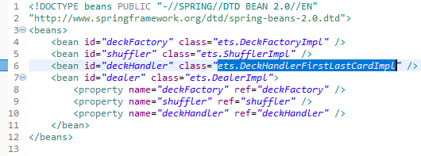
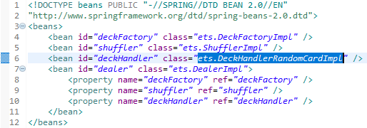
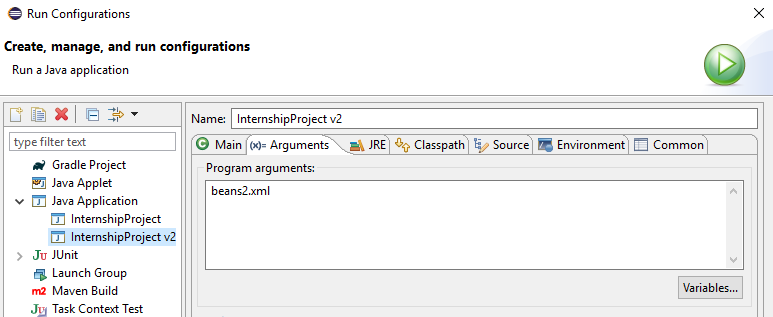

# ETS
**The 52 card application is configured through the Spring framework. The files included under the resources directory beans1.xml and 
beans2.xml are the 2 configurations for the program to initialize the program.**

**beans1.xml is the default configuration that is run when the command line argument in the main method is not specified. The value
highlighted in blue in the image below defines the implementation of the deckHandler which deals the first Card from the Deck of 52 cards.**

**beans1.xml**

**beans2.xml is a specified configuration that is run when the command line argument in the main method is specified as beans2.xml.
The value highlighted in blue in the image below defines the implementation of the deckHandler which deals a random Card from the
Deck of 52 cards.**

**beans2.xml**

**The basic concept of using the Spring framework is to ensure flexibility in configuring the program without modification to the code.
The image below presents the configuration of the InternshipProject v2 configuration that uses the beans2.xml as the program argument
to initialize a different configuration of the program.**

**Run Configurations Tab**

